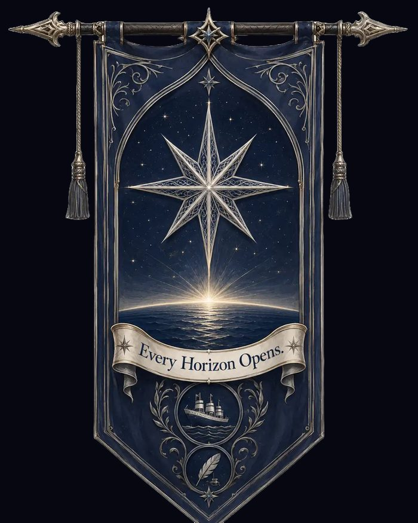
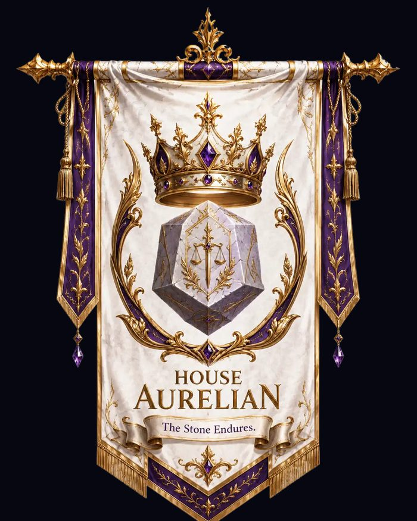
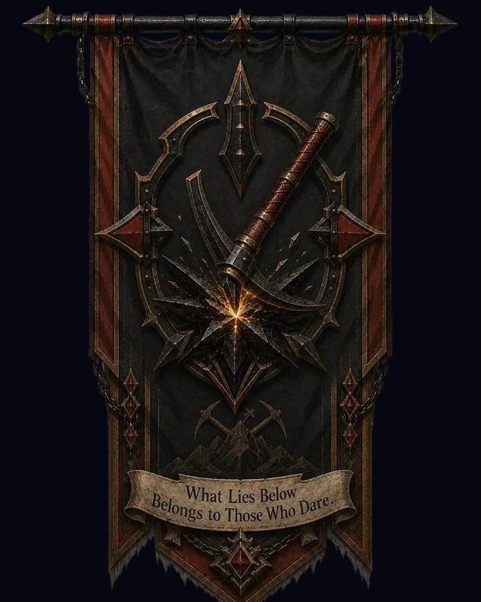
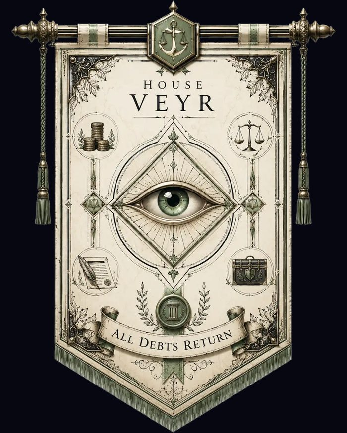
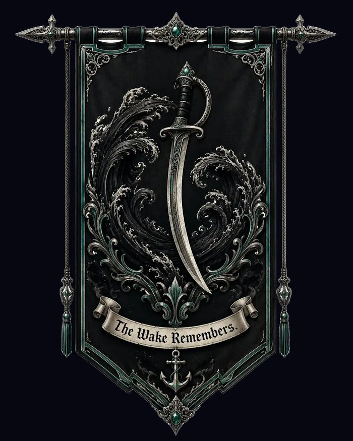
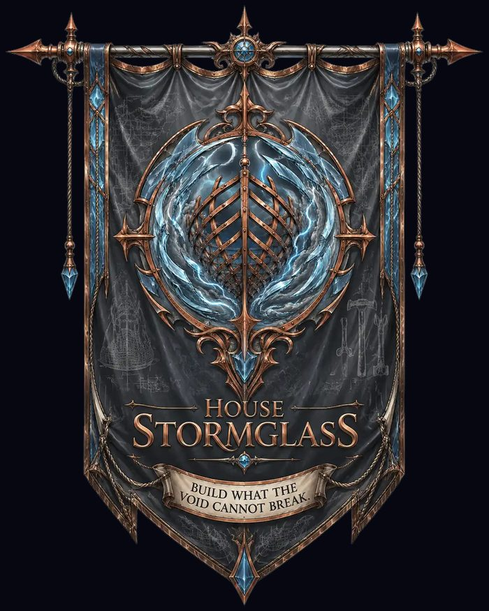
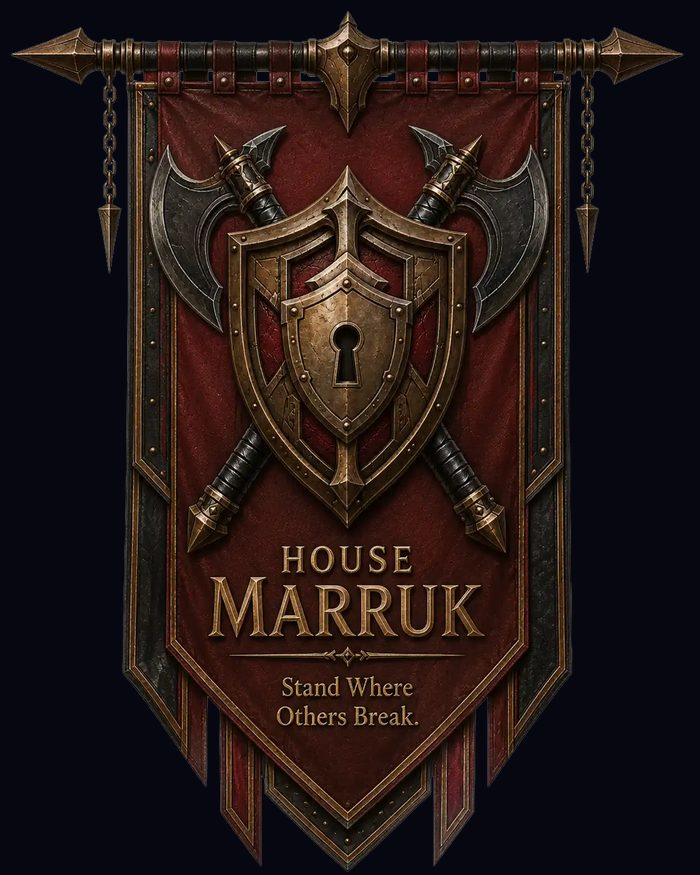
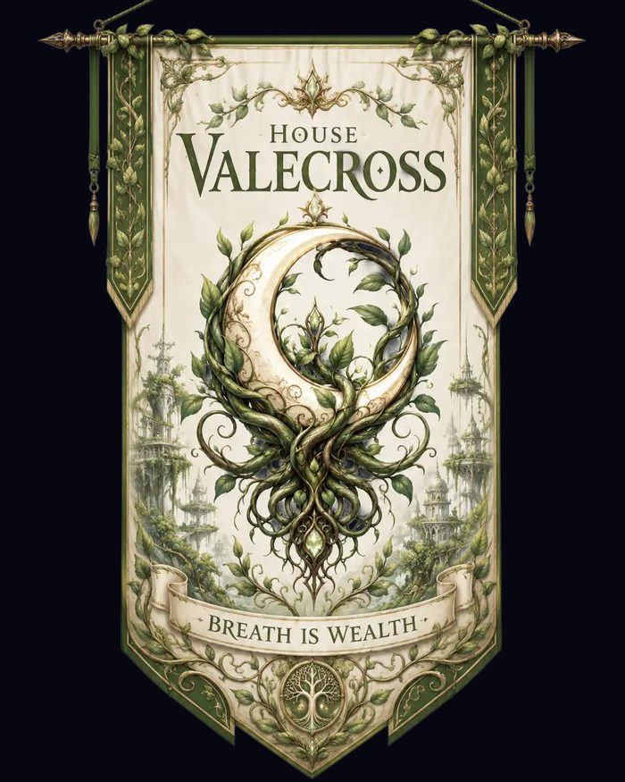
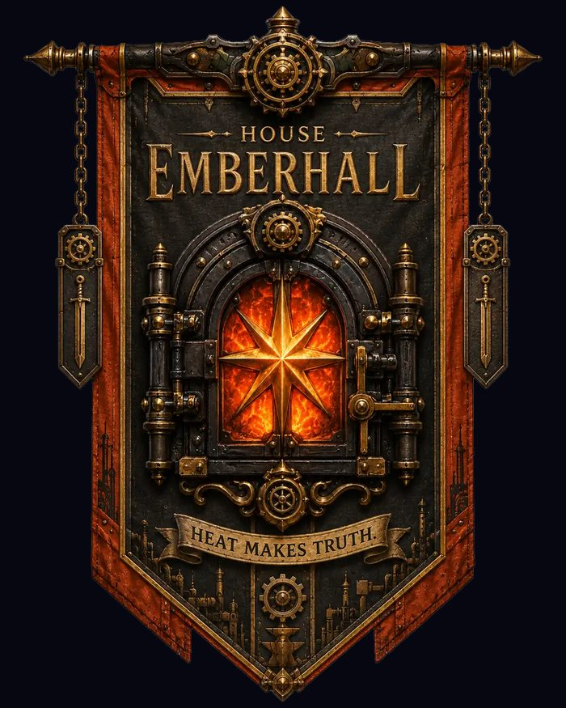
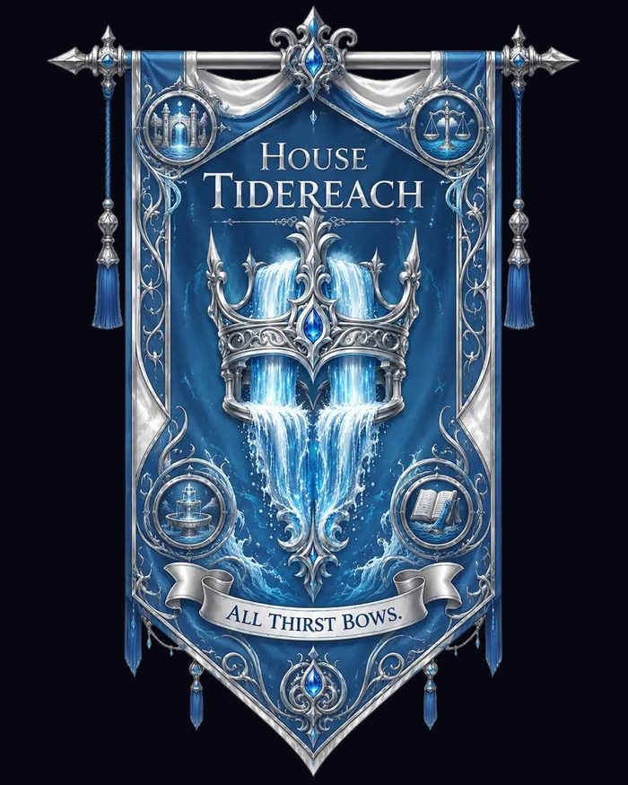

# The Great Houses of Ayerstone

The Great Houses are the noble, commercial, military, industrial, agricultural, financial, and infrastructural powers that shape public life in Ayerstone.

## Choose a House

Every banner below opens that house's page. Each house carries a public face, a sphere of power, and a reputation that follows its colors through the streets, courts, docks, and guildhalls of Ayerstone.

  <a class="house-card house-starweaver" href="starweaver/" aria-label="Open House Starweaver">
    
    ✦
    House Starweaver
    “Every horizon opens.”
    Horizon routes, trade, exploration, shipping, and jump-route influence.
    TradeShippingRoutes
  </a>

  <a class="house-card house-aurelian" href="aurelian/" aria-label="Open House Aurelian">
    
    ♛
    House Aurelian
    “The Stone Endures.”
    Royal legitimacy, governance, dynastic tradition, and the burden of old bargains.
    CrownLawLegacy
  </a>

  <a class="house-card house-ironmantle" href="ironmantle/" aria-label="Open House Ironmantle">
    
    ◆
    House Ironmantle
    “What lies below belongs to those who dare.”
    Mining rights, aetherite claims, stoneworks, tunnels, and Deepstone power.
    StoneMiningAetherite
  </a>

  <a class="house-card house-veyr" href="veyr/" aria-label="Open House Veyr">
    
    ⟠
    House Veyr
    “All debts return.”
    Banking, contracts, insurance, ledgers, debt, and quiet financial leverage.
    BankingDebtContracts
  </a>

  <a class="house-card house-blackwake" href="blackwake/" aria-label="Open House Blackwake">
    
    ☽
    House Blackwake
    “The Wake Remembers.”
    Privateers, escort fleets, convoy protection, armed contracts, and dangerous waters.
    PrivateersEscortsConvoys
  </a>

  <a class="house-card house-stormglass" href="stormglass/" aria-label="Open House Stormglass">
    
    ⚙
    House Stormglass
    “Build what the void cannot break.”
    Shipbuilding, engineering, inventions, dockyard contracts, and experimental designs.
    ShipsEnginesDesign
  </a>

  <a class="house-card house-marruk" href="marruk/" aria-label="Open House Marruk">
    
    ⛨
    House Marruk
    “Stand where others break.”
    Royal security, mercenaries, watch contracts, bodyguards, and disciplined vigilance.
    SecurityGuardsOaths
  </a>

  <a class="house-card house-valecross" href="valecross/" aria-label="Open House Valecross">
    
    ❦
    House Valecross
    “Breath is wealth.”
    Agriculture, Lifeveil ecology, gardens, food supply, and old fey-rooted influence.
    FoodGardensLifeveil
  </a>

  <a class="house-card house-emberhall" href="emberhall/" aria-label="Open House Emberhall">
    
    ✹
    House Emberhall
    “Heat makes truth.”
    Foundries, factories, manufacturing, industrial contracts, and the heat of progress.
    IndustryFoundriesLabor
  </a>

  <a class="house-card house-tidereach" href="tidereach/" aria-label="Open House Tidereach">
    
    ≋
    House Tidereach
    “All thirst bows.”
    Water rights, canals, Falls infrastructure, reservoirs, and the flow of public life.
    WaterCanalsFalls
  </a>

